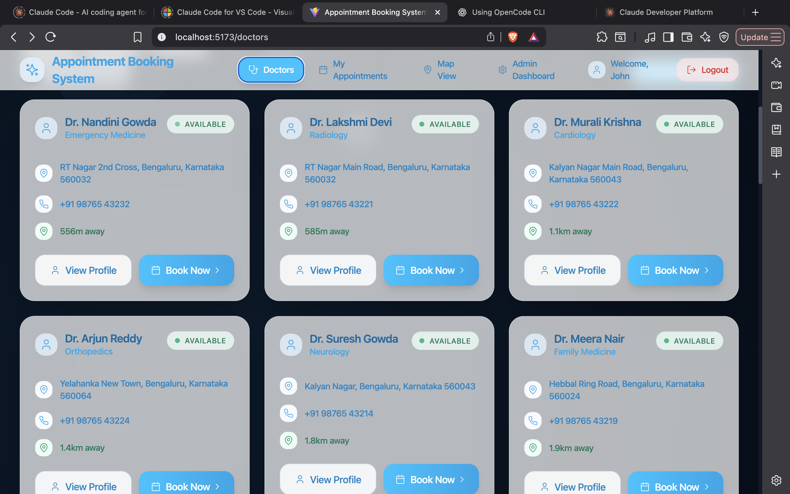
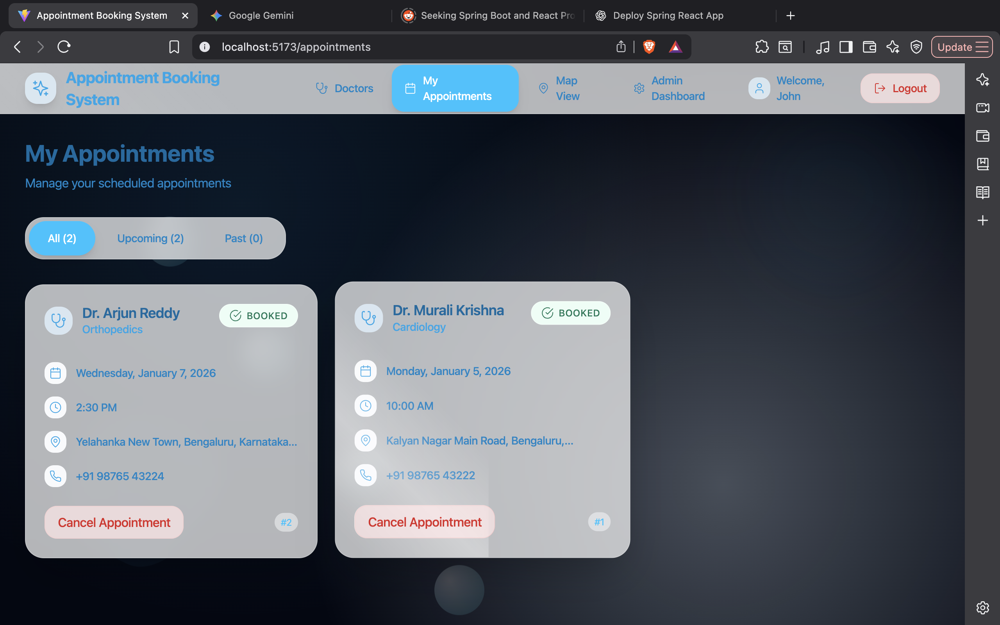
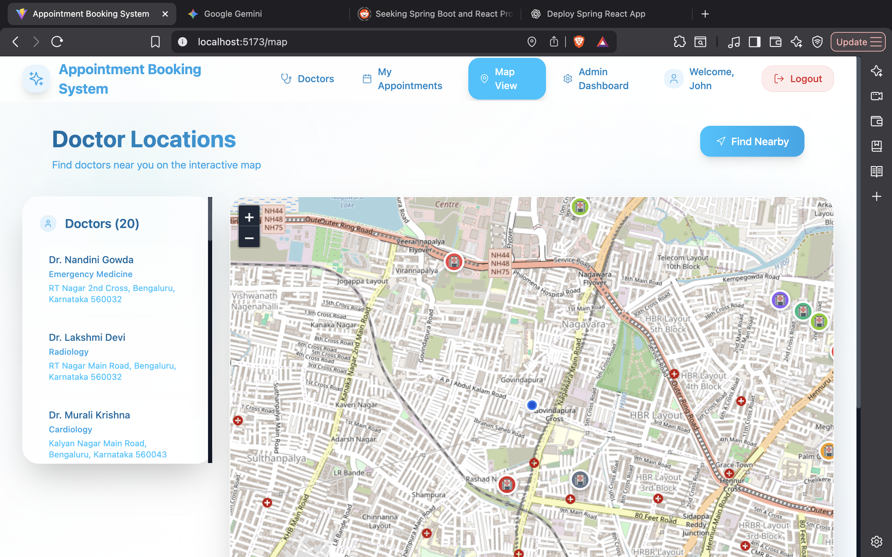

# 🏥 Appointment Booking System

A full-stack medical appointment booking system that allows users to find nearby doctors, book appointments in real time, and manage schedules through an intuitive admin dashboard.

---

## ✨ Features

- 🩺 **Doctor Discovery** – Browse doctors by specialty, location, and availability  
- 📍 **Location-Based Search** – Find nearby doctors using an interactive map  
- 🔐 **Google OAuth Authentication** – Secure sign-in with Google  
- 📅 **Appointment Management** – Book, view, and cancel appointments  
- 🛠️ **Admin Dashboard** – Manage users, doctors, and appointments  
- 📱 **Responsive UI** – Optimized for desktop and mobile devices  

---

## 📸 Application Screenshots

### 🩺 Doctors Listing
Browse available doctors with specialties, distance, and live availability.



---

### 📅 My Appointments
View upcoming appointments and cancel bookings when needed.



---

### 🗺️ Map View
Locate nearby doctors on an interactive map.



---

### 🛠️ Admin Dashboard
Monitor users, doctors, and appointment activity.


---

## 🛠️ Tech Stack

### Frontend
- React 18 (Vite)
- Tailwind CSS
- Framer Motion
- Leaflet Maps
- Axios

### Backend
- Spring Boot 3 (Java 17)
- PostgreSQL
- Spring Security
- JWT Authentication
- Google OAuth 2.0
- JPA / Hibernate

---

## 🚀 Getting Started

### Prerequisites
- Node.js 18+
- Java 17+
- PostgreSQL
- Maven

---

### Local Setup

#### 1️⃣ Clone the repository
```bash
git clone https://github.com/allanmaaz/appointment-booking-system.git
cd appointment-booking-system
